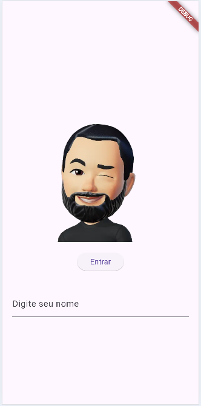
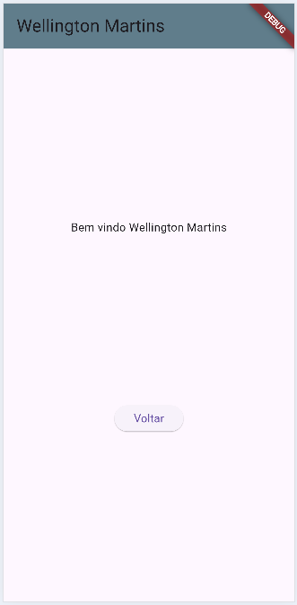

# Splash
Exemplo de uma **Splash Screen** com animação de entrada e saída com Flutter

## Tecnologias
- Flutter
- VsCode
- Android Studio

|Efeitos|WidGets|
|-|:-:|
|Transparência / Opacidade|Opacity|
|Transformação|Transform|
|Imagens|Image.asset()|
|Assincronicidade|async|
|Controle de tempo|Timer|
|Controle de tamanho e opacidade|AnimationController|
|Compartilhamento de dados entre telas (shared, "LocalStorage")|Biblioteca: shared_preferences.dart SharedPreferences|
|Conversão de dados|json.encode(), json.decode()|

|||
|-|-|
|Splash|Home|

# Para testar
- 1 Clone o repositório
- 2 Abra com VsCode, Abra o trminal **CTRL + "**, execute o comando `flutter pub get` para instalar as dependências
- 3 Navegue até o arquivo lib/main.dart e dê **play** ou execute o comando `flutter run` para rodar o projeto
- 4 Escolha navegador ou um emulador para testar
- O projeto irá abrir a tela de Splash com uma animação, preencha seu nome e clique em entrar.

## Aividades
- 1 Crie um novo projeto com tela Splash com animação de movimento e passando dados de uma tela para outra
    - Carregando uma imagem aparecendo de cima para baixo até o centro da tela
    - Com um campo de texto para digitar o nome
    - Outro campo de texto para digitar a idade
    - E um botão que redirecione para outra tela Home.
    - Na outra tela mostre o nome e a idade do usuário

## Entregas
crie um repositório público do github e hospede com prints das telas, tecnologias e instruções de como testar em README.md conforme este exemplo. Apresente ao seu professor.